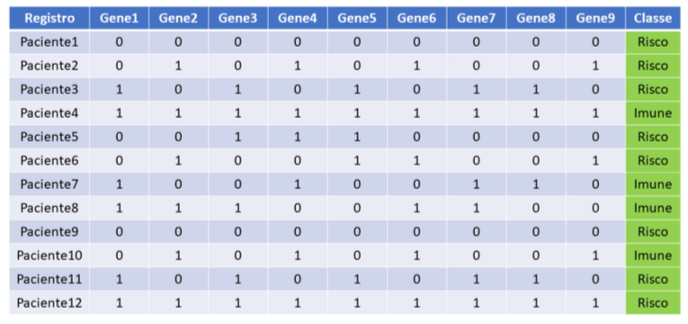
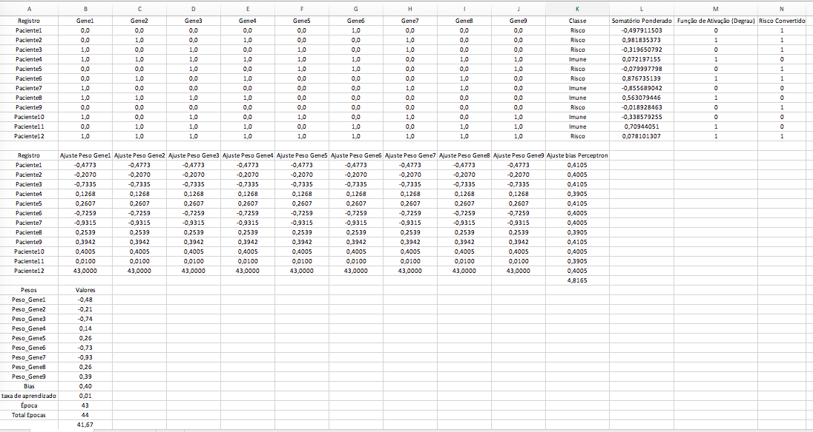

# Perceptron: Uma Abordagem Educacional para a Classificação Binária

### Como reproduzir a Técnica de Perceptron no MS Excel, Python, R, Julia e Scala
---

### **Resumo:**

Este artigo apresenta uma implementação do algoritmo de Perceptron de um único neurônio utilizando diferentes ferramentas: Microsoft Excel, Python, R, Julia e Scala. O Perceptron é um dos algoritmos mais fundamentais no aprendizado de máquina, amplamente utilizado para tarefas de classificação binária. Discutimos brevemente a teoria por trás do Perceptron e fornecemos uma visão prática de como reproduzi-lo em cada uma dessas plataformas, detalhando os prós e contras de cada abordagem.

No Microsoft Excel, a implementação do Perceptron é usada principalmente como uma ferramenta didática, permitindo uma visualização clara e acessível dos processos de ajuste de pesos e bias. No entanto, suas limitações em termos de escalabilidade e performance o tornam inadequado para projetos complexos e de grande escala.

Por outro lado, linguagens como Python, R, Julia e Scala oferecem uma ampla gama de bibliotecas especializadas em aprendizado de máquina que facilitam a implementação e otimização de modelos como o Perceptron. Estas linguagens são amplamente usadas em ambientes de produção devido à sua robustez, eficiência computacional e capacidade de lidar com grandes volumes de dados.

Ao longo deste artigo, exploramos como essas diferentes plataformas podem ser utilizadas para implementar e treinar um Perceptron, destacando suas vantagens, limitações e quando cada uma delas é mais adequada para diferentes cenários.

---

## 1. **Introdução**

O campo do aprendizado de máquina tem se expandido rapidamente, e o Perceptron é uma das unidades fundamentais das redes neurais, utilizado para resolver problemas de classificação binária linearmente separáveis. Introduzido por **Frank Rosenblatt** em 1958, o Perceptron simula o comportamento de um neurônio biológico, servindo como base para arquiteturas mais complexas no aprendizado de máquina, como as redes neurais profundas.

Apesar da disponibilidade de linguagens de programação avançadas como **Python, R, Julia e Scala**, que oferecem bibliotecas otimizadas e recursos poderosos para machine learning, o Microsoft Excel ainda pode ser útil como uma ferramenta educacional. Ele permite a visualização dos cálculos envolvidos no funcionamento de um Perceptron de forma clara e acessível, sendo uma plataforma adequada para desmistificar o conceito de redes neurais para iniciantes.

No entanto, é importante destacar que o Excel, devido às suas limitações de performance e escalabilidade, não é adequado para a implementação de tarefas avançadas de aprendizado de máquina ou para o processamento de grandes volumes de dados. Ferramentas como Python e R, com bibliotecas como scikit-learn e caret, são amplamente reconhecidas como as plataformas apropriadas para tais tarefas, oferecendo robustez e eficiência para modelos mais complexos e grandes volumes de dados.

O objetivo deste artigo é usar o Excel para fornecer uma compreensão clara e prática de como um Perceptron funciona, demonstrando passo a passo seu processo de ajuste de pesos e bias. Através desta abordagem simplificada, esperamos desmistificar o uso das redes neurais e deixar claro que, embora o Excel possa ser uma ferramenta útil para o aprendizado didático, ele não é capaz de realizar tarefas de machine learning em escala sem o uso de ferramentas especializadas e apropriadas.

---
Aqui está a reformulação e expansão da seção de **Revisão Teórica** para o seu artigo, mantendo o foco na clareza, precisão teórica e no contexto educacional. A formatação das equações também foi ajustada para facilitar a leitura e compreensão.

---

## 2. **Revisão Teórica**

### **Teoria do Perceptron**

#### **O Perceptron: Um Modelo Linear**

O **Perceptron** é um algoritmo de **classificação binária** baseado em um **somatório ponderado** das entradas, que gera uma saída binária (previsão). Cada entrada tem um **peso** associado, que reflete sua importância no processo de previsão, e o Perceptron aprende ajustando esses pesos durante o **treinamento**. Esse ajuste é feito a partir dos erros cometidos pelo modelo em cada iteração.

O Perceptron é utilizado para distinguir duas classes, como "positivo" e "negativo", ou, como no caso deste estudo, "Risco" e "Imune". Seu funcionamento é o de um **classificador linear**, o que significa que ele pode separar as duas classes utilizando uma **linha reta** ou um **hiperplano**, caso os dados estejam em dimensões superiores. A linearidade do modelo implica que ele pode resolver apenas problemas onde as classes são **linearmente separáveis**.

#### **Estrutura do Perceptron**

O Perceptron é composto pelos seguintes elementos básicos:

```Perceptron
     x_1 ---- w_1 \
     x_2 ---- w_2  \               ____ Função Degrau (z > 0 ? 1 : 0)
     x_3 ---- w_3  / --[Somatório] ---> Saída
     ...          /
     x_n ---- w_n/                 +--- Bias
```
- **Entradas**: Os atributos ou características de cada exemplo, representados como um vetor de entradas **x**.
- **Pesos**: Cada entrada possui um peso **\(w_i\)**, que indica a relevância dessa característica para a previsão final.
- **Bias**: Um termo adicional que ajuda a deslocar a função de ativação, tornando o modelo mais flexível na criação de uma fronteira de decisão.
- **Função de Ativação**: A função que transforma o **somatório ponderado** das entradas em uma **saída binária** (0 ou 1).

#### **Funcionamento Matemático do Perceptron**

O Perceptron calcula o somatório ponderado das entradas da seguinte forma:

```
z = (w_1 * x_1) + (w_2 * x_2) + ... + (w_n * x_n) + bias
```

Onde:
- **\(x_i\)** são os valores das entradas,
- **\(w_i\)** são os pesos associados a cada entrada,
- **bias** é o termo adicional que ajusta o ponto de decisão,
- **z** é o somatório ponderado que será usado para calcular a saída do Perceptron.

A função de ativação é então aplicada ao valor de **z** para determinar a **classe prevista** pelo modelo.

---

#### **Função de Ativação**

O Perceptron utiliza a **função degrau** como função de ativação. Essa função converte o valor do somatório ponderado **z** em uma saída binária, indicando se o exemplo pertence à **classe positiva** (1) ou à **classe negativa** (0).

A função degrau é definida como:

```
saída = 
  1, se z > 0
  0, se z ≤ 0
```

Em outras palavras, se o valor ponderado **z** for maior que zero, o Perceptron prevê a **classe positiva** (por exemplo, "Risco"). Caso contrário, ele prevê a **classe negativa** (por exemplo, "Imune").

A simplicidade dessa função a torna ideal para tarefas de **classificação binária**, embora ela seja limitada em problemas mais complexos.

---

#### **Treinamento do Perceptron**

O treinamento do Perceptron ocorre de maneira **iterativa**, e o modelo ajusta seus pesos e bias sempre que a previsão feita está incorreta, ou seja, quando a saída prevista é diferente da **classe real** do exemplo. O objetivo do treinamento é minimizar o erro de previsão, ajustando os pesos para que, em iterações subsequentes, o modelo aprenda a classificar os exemplos corretamente.

A **regra de atualização dos pesos** é expressa matematicamente da seguinte forma:

```
w_novo = w_atual + (α * erro * x_i)
```

E a **regra de ajuste do bias** é:

```
bias_novo = bias_atual + (α * erro)
```

Onde:
- **α (alfa)** é a **taxa de aprendizado**, que controla o tamanho do passo no ajuste dos pesos.
- **erro** é a diferença entre o valor real da classe e a previsão feita pelo Perceptron.
- **\(x_i\)** são os valores das entradas.

Durante o treinamento, o Perceptron faz ajustes nos pesos com base nos erros de previsão, até que o modelo alcance um número pré-determinado de épocas (iterações) ou até que o erro seja suficientemente pequeno.

---

#### **Limitações do Perceptron**

Embora o Perceptron seja eficaz para **problemas linearmente separáveis**, ele **falha** em resolver problemas onde as classes não podem ser separadas por uma linha reta. Um exemplo clássico desse tipo de problema é o **XOR**, onde as classes não podem ser divididas de forma linear. 

Para lidar com esses problemas mais complexos, é necessário o uso de modelos mais avançados, como o **Perceptron Multicamadas (MLP)**. O MLP é capaz de aprender **fronteiras de decisão não lineares** e é amplamente utilizado em redes neurais profundas, que são aplicáveis em problemas que envolvem dados mais complexos e não linearmente separáveis.

---

### 3. **Metodologia**

A implementação do Perceptron foi realizada em uma planilha do Microsoft Excel com o objetivo de criar uma ferramenta visual e interativa para o aprendizado dos conceitos básicos de redes neurais. O Excel foi escolhido por sua acessibilidade e familiaridade para a maioria dos usuários, sendo uma ótima ferramenta didática para visualizar e manipular cada etapa do processo de treinamento de um Perceptron.

#### 3.1 Configuração dos Dados

Para simular o funcionamento do Perceptron, uma tabela de dados foi construída representando as entradas (atributos) e as saídas (classes) de diferentes exemplos. No contexto deste estudo, cada exemplo é representado por um conjunto de n atributos (genes, por exemplo), e cada exemplo pertence a uma das duas classes: "Risco" (classe positiva) ou "Imune" (classe negativa).

```
| Registro   | Gene1 | Gene2 | Gene3 | ... | Gene9 | Classe  |
|------------|-------|-------|-------|-----|-------|---------|
| Paciente1  | 0     | 1     | 0     | ... | 1     | Risco   |
| Paciente2  | 1     | 0     | 1     | ... | 0     | Imune   |
...
| Paciente12 | 1     | 0     | 1     | ... | 0     | Imune   |
```



Colunas de entrada (Gene1, Gene2, ... GeneN): Representam as características dos exemplos (genes).
Coluna de saída (Classe): Indica se o exemplo pertence à classe "Risco" (1) ou "Imune" (0).

**Gerando o CSV com os valores da matriz de referência*
O seguinte código Python foi utilizado para gerar um arquivo CSV contendo a matriz de dados para a implementação do Perceptron, que inclui as características (genes) e suas respectivas classes:
```Python
import pandas as pd

# Criando a matriz de dados com os genes e classes conforme a tabela fornecida
data = {
    "Registro": [f"Paciente{i}" for i in range(1, 13)],
    "Gene1": [0, 0, 1, 1, 0, 0, 1, 1, 0, 1, 0, 1],
    "Gene2": [0, 1, 0, 1, 0, 1, 0, 1, 0, 0, 1, 1],
    "Gene3": [0, 0, 1, 1, 1, 0, 0, 1, 0, 1, 1, 1],
    "Gene4": [0, 1, 0, 1, 0, 1, 0, 1, 0, 0, 1, 1],
    "Gene5": [0, 0, 1, 1, 1, 0, 0, 0, 0, 1, 0, 1],
    "Gene6": [1, 0, 0, 1, 1, 0, 0, 0, 0, 0, 1, 1],
    "Gene7": [0, 1, 1, 0, 0, 0, 1, 0, 0, 1, 0, 1],
    "Gene8": [0, 0, 0, 1, 0, 1, 1, 0, 0, 0, 1, 1],
    "Gene9": [0, 0, 0, 1, 1, 0, 0, 0, 0, 1, 1, 1],
    "Classe": ["Risco", "Risco", "Risco", "Imune", "Risco", "Risco", "Imune", "Imune", "Risco", "Imune", "Imune", "Risco"]
}

# Criando o DataFrame
df = pd.DataFrame(data)

# Salvando o DataFrame em um arquivo CSV
file_path = "/mnt/data/matriz_genes_perceptron.csv"
df.to_csv(file_path, index=False)

```

#### 3.2. **Passo a Passo para a Construção da Planilha Excel com o Perceptron**:
- [Planilha](https://github.com/renatomenendes/Percptron_in_XLS/blob/main/Perceptrom%201%20neuro%CC%82nio.xlsx)
#### 3.2.1. **Estrutura da Tabela de Dados**
A primeira parte da planilha consiste em uma tabela com os registros de dados (pacientes) e seus respectivos genes, além da classe atribuída a cada exemplo (Risco ou Imune). Para criar essa estrutura, siga os seguintes passos:

##### 3.2.1.1. **Colunas de Dados:**
- **Coluna A:** "Registro" — Lista de pacientes ou exemplos.
- **Colunas B a J:** "Gene1" a "Gene9" — Valores binários (0 ou 1) representando as características de cada paciente.
- **Coluna K:** "Classe" — Valores categóricos representando a classe real de cada exemplo ("Risco" ou "Imune").

##### 3.2.1.2. **Exemplo de Dados:**
| Registro   | Gene1 | Gene2 | Gene3 | Gene4 | Gene5 | Gene6 | Gene7 | Gene8 | Gene9 | Classe  |
|------------|-------|-------|-------|-------|-------|-------|-------|-------|-------|---------|
| Paciente1  | 0     | 0     | 0     | 0     | 0     | 1     | 0     | 0     | 0     | Risco   |
| Paciente2  | 0     | 1     | 0     | 1     | 0     | 0     | 1     | 0     | 0     | Risco   |
| ...        | ...   | ...   | ...   | ...   | ...   | ...   | ...   | ...   | ...   | ...     |

#### 3.2.2. **Cálculo do Somatório Ponderado**
O somatório ponderado é calculado a partir dos valores dos genes e dos pesos atribuídos a cada gene. A fórmula soma o produto de cada gene com seu respectivo peso, além de adicionar o **bias** ao resultado.

##### 3.2.2.1. **Fórmula para o Somatório Ponderado:**
```excel
=SOMA(B2*$B$16, C2*$B$17, D2*$B$18, ..., J2*$B$24) + $B$25
```
- **B2 a J2:** Representam os genes do paciente.
- **$B$16 a $B$24:** Contêm os pesos associados a cada gene.
- **$B$25:** Representa o valor do bias.
  
##### 3.2.2.2. **Coluna L:** "Somatório Ponderado" — Contém o resultado desse cálculo para cada paciente.

#### 3.3. **Função de Ativação (Degrau)**
Após calcular o somatório ponderado, aplica-se a função de ativação **degrau** para determinar a saída binária. Essa função verifica se o somatório ponderado é maior que zero e retorna 1 (classe positiva) ou 0 (classe negativa).

##### 3.3.1. **Fórmula da Função de Ativação:**
```excel
=SE(L2 > 0, 1, 0)
```
- **L2:** É o valor do somatório ponderado.

##### 3.3.1.2. **Coluna M:** "Função de Ativação (Degrau)" — Contém a saída binária (0 ou 1) para cada exemplo.

#### 3.4. **Conversão da Classe para Valores Numéricos**
A classe real ("Risco" ou "Imune") precisa ser convertida em valores binários para que possa ser comparada com a previsão feita pelo Perceptron. A classe "Risco" é representada por 1, e a classe "Imune" é representada por 0.

##### 3.4.1. **Fórmula de Conversão:**
```excel
=SE(K2="Risco", 1, 0)
```
- **K2:** É a célula contendo a classe categórica.

##### 3.4.2. **Coluna N:** "Risco Convertido" — Contém o valor binário da classe real (1 para "Risco" e 0 para "Imune").

#### 3.5. **Ajuste de Pesos e Bias**
O ajuste dos pesos é feito com base no erro da previsão, ou seja, a diferença entre a saída prevista e a classe real. Esse ajuste é repetido em cada iteração (época) de treinamento.

##### 3.5.1. **Fórmula para Atualização dos Pesos:**
```excel
=Peso_Atual + (Taxa_de_Aprendizado * Erro * Gene)
```
Por exemplo, para o peso associado ao Gene1, a fórmula seria:
```excel
=B16 + $B$26*(N2 - M2)*B2
```
- **B16:** Peso atual do Gene1.
- **$B$26:** Taxa de aprendizado (valor fixo).
- **N2:** Valor real da classe (convertido).
- **M2:** Previsão feita pelo Perceptron.
- **B2:** Valor do Gene1.

##### 3.5.2. **Coluna O a W:** Pesos ajustados para cada gene.

#### 3.6. **Ajuste do Bias**
O bias também é ajustado com base no erro, da mesma forma que os pesos.

##### 3.6.1. **Fórmula para Atualização do Bias:**
```excel
=Bias_Atual + (Taxa_de_Aprendizado * Erro)
```
- **Bias_Atual:** É o valor atual do bias.
- **Erro:** Diferença entre o valor real e a previsão.

##### 3.6.2. **Coluna X:** Bias ajustado após cada iteração.

#### 3.7. **Verificação de Erros e Critério de Parada**
O processo de ajuste continua até que o Perceptron consiga prever corretamente todas as classes ou até que um número máximo de iterações seja atingido.

#### 3.8. **Visualização dos Resultados**
Ao final do processo, a planilha exibirá os pesos ajustados e as previsões feitas pelo Perceptron para cada paciente, comparando-as com as classes reais.



---

#### 4. **Comparação com Outros Modelos**

Ao implementar o Perceptron em diferentes linguagens de programação, conseguimos explorar como cada uma lida com o algoritmo em termos de sintaxe, clareza e funcionalidade. Vamos explorar as implementações em Python, R, Julia, e Scala, destacando as particularidades de cada linguagem e comparando as vantagens e limitações em termos de facilidade de uso, desempenho e aplicabilidade em cenários educacionais e de produção.

##### 4.1. Implementação em Python

O Python é uma das linguagens mais utilizadas no campo do aprendizado de máquina, devido à sua simplicidade e vasta quantidade de bibliotecas disponíveis, como NumPy, scikit-learn, e TensorFlow. No exemplo abaixo, utilizamos NumPy para realizar cálculos matriciais e implementar o Perceptron de forma clara e concisa.

```Python
import numpy as np

# Dados de treinamento
X = np.array([...])  # Matrizes de genes
y = np.array([1, 1, 1, 0, 1, 1, 0, 0, 1, 0, 0, 1])  # Classes: 1 = Risco, 0 = Imune

# Inicializando pesos e bias
pesos = np.zeros(X.shape[1])
bias = 0
taxa_aprendizagem = 0.1
epocas = 1000

# Função de ativação (step function)
def step_func(z):
    return 1 if z > 0 else 0

# Treinamento do Perceptron
for _ in range(epocas):
    for i in range(X.shape[0]):
        z = np.dot(X[i], pesos) + bias
        y_pred = step_func(z)
        erro = y[i] - y_pred
        pesos += taxa_aprendizagem * erro * X[i]
        bias += taxa_aprendizagem * erro

# Resultados
print("Pesos treinados:", pesos)
print("Bias treinado:", bias)

```
[Executio Python](Execution_Python.png)
Vantagens: Python tem uma curva de aprendizado suave e a simplicidade de código torna o desenvolvimento de modelos mais rápido. Além disso, o uso de bibliotecas como NumPy facilita a implementação de operações vetorizadas, reduzindo o número de loops e melhorando a performance.
Limitações: Embora Python seja excelente para prototipagem, pode não ser a melhor escolha em cenários onde o desempenho em tempo real é crítico.

##### 4.2. Implementação em R

O R é amplamente utilizado em estatísticas e análise de dados. A implementação do Perceptron em R segue uma abordagem funcional, sendo relativamente fácil de entender para quem tem familiaridade com a linguagem. O cálculo matricial é direto, mas a implementação de loops pode ser menos otimizada.

```R
# Dados e classes
X <- matrix([...], ncol=9, byrow=TRUE)
y <- c(1, 1, 1, 0, 1, 1, 0, 0, 1, 0, 0, 1)

# Inicializando pesos e bias
pesos <- rep(0, ncol(X))
bias <- 0
taxa_aprendizagem <- 0.1
epocas <- 1000

# Função de ativação
step_func <- function(z) {
  if (z > 0) 1 else 0
}

# Treinamento
for (epoca in 1:epocas) {
  for (i in 1:nrow(X)) {
    z <- sum(X[i, ] * pesos) + bias
    y_pred <- step_func(z)
    erro <- y[i] - y_pred
    pesos <- pesos + taxa_aprendizagem * erro * X[i, ]
    bias <- bias + taxa_aprendizagem * erro
  }
}

# Resultados
cat("Pesos treinados: ", pesos, "\n")
cat("Bias treinado: ", bias, "\n")
```

 - Vantagens: A linguagem R oferece uma excelente interface para análise de dados e visualização. É fácil integrar o treinamento do Perceptron com gráficos e outros tipos de análise exploratória.
 - Limitações: Comparado a Python e Julia, R pode ser menos eficiente no gerenciamento de grandes volumes de dados ou operações computacionalmente intensivas.

##### 4.3. **Implementação em Julia**

O Julia é uma linguagem relativamente nova, projetada para alto desempenho em operações numéricas, sendo uma excelente escolha para computação científica. A sintaxe é limpa e, assim como Python, Julia oferece suporte para operações vetorizadas e ótimo desempenho em cálculos matriciais.

```Julia
X = [ ... ]  # Dados de treinamento
y = [1, 1, 1, 0, 1, 1, 0, 0, 1, 0, 0, 1]

pesos = zeros(size(X, 2))
bias = 0
taxa_aprendizagem = 0.1
epocas = 1000

# Função de ativação
step_func(z) = z > 0 ? 1 : 0

# Treinamento
for _ in 1:epocas
    for i in 1:size(X, 1)
        z = dot(X[i, :], pesos) + bias
        y_pred = step_func(z)
        erro = y[i] - y_pred
        pesos += taxa_aprendizagem * erro * X[i, :]
        bias += taxa_aprendizagem * erro
    end
end
```

 - Vantagens: Julia oferece performance comparável a linguagens de baixo nível como C, sem perder a simplicidade de linguagens de alto nível. Isso faz com que ela seja uma excelente escolha para projetos que exigem velocidade em cálculos científicos.
 - Limitações: Julia ainda tem uma base de usuários menor e menos suporte em termos de bibliotecas prontas, se comparada ao Python.

##### 4.4. **Implementação em Scala**

O Scala é uma linguagem funcional e orientada a objetos, frequentemente usada para programação de sistemas distribuídos. Embora o Scala não seja amplamente utilizado para aprendizado de máquina, sua robustez e compatibilidade com o ecossistema Java o tornam uma escolha interessante em certos cenários.

```Scala
object Perceptron {
  def main(args: Array[String]): Unit = {
    val X = Array([...])
    val y = Array(1, 1, 1, 0, 1, 1, 0, 0, 1, 0, 0, 1)

    var pesos = Array.fill(X(0).length)(0.0)
    var bias = 0.0
    val taxaAprendizagem = 0.1
    val epocas = 1000

    def stepFunc(z: Double): Int = if (z > 0) 1 else 0

    for (_ <- 1 to epocas) {
      for (i <- X.indices) {
        val z = (X(i) zip pesos).map { case (xi, wi) => xi * wi }.sum + bias
        val yPred = stepFunc(z)
        val erro = y(i) - yPred
        pesos = (pesos zip X(i)).map { case (w, xi) => w + taxaAprendizagem * erro * xi }
        bias += taxaAprendizagem * erro
      }
    }

    println(s"Pesos treinados: ${pesos.mkString(", ")}")
    println(s"Bias treinado: $bias")
  }
}
```

 - Vantagens: Scala é altamente escalável e pode ser integrado em sistemas distribuídos, o que o torna uma escolha poderosa para grandes sistemas de processamento de dados.
 - Limitações: Comparado com linguagens mais simples como Python e Julia, a curva de aprendizado de Scala pode ser mais íngreme, especialmente para usuários iniciantes.

#### **Conclusão da Comparação**
Ao comparar as implementações em Python, R, Julia, e Scala, observamos que:

 - Python: É a linguagem mais acessível para iniciantes, com uma ampla gama de bibliotecas para aprendizado de máquina, mas pode não ser a mais eficiente em termos de desempenho em grandes volumes de dados.
 - R: É ideal para análise estatística e visualização de dados, mas seu desempenho em tarefas de aprendizado de máquina pode ser inferior a outras linguagens.
 - Julia: Combina a simplicidade de Python com o desempenho de linguagens de baixo nível, sendo ideal para computação científica e algoritmos intensivos.
 - Scala: É robusto para grandes sistemas distribuídos e integra-se perfeitamente ao ecossistema Java, mas sua complexidade pode ser uma barreira para quem busca soluções rápidas.
Essas linguagens oferecem diferentes ferramentas e paradigmas, permitindo que o usuário escolha a mais adequada para seu cenário de uso específico, seja ele educacional ou de produção.

---

### 5. **Conclusão**

Apesar de ser amplamente utilizado em diferentes áreas, o Microsoft Excel é uma ferramenta limitada quando se trata de aprendizado de máquina e ciência de dados. Sua popularidade nesses campos não se deve à sua capacidade técnica, mas sim à sua familiaridade e acessibilidade. Excel não é uma ferramenta ideal para tarefas complexas de machine learning, como manipulação de grandes volumes de dados, construção de modelos avançados ou otimização de hiperparâmetros.

O Excel pode ser útil em contextos educacionais para ajudar a visualizar conceitos básicos, como a implementação de um Perceptron simples ou a análise de dados de pequena escala. No entanto, sua aplicabilidade em projetos mais robustos é extremamente limitada.

Há uma abundância de ferramentas open-source robustas desenvolvidas especificamente para aprendizado de máquina e ciência de dados, como Python (com bibliotecas como scikit-learn, TensorFlow, PyTorch), R, e até mesmo soluções no-code que oferecem maior flexibilidade e poder computacional sem os gargalos de uma planilha.

O uso do Excel em tais cenários muitas vezes está relacionado à falta de disposição para aprender ferramentas mais apropriadas, e não à falta de recursos ou alternativas. O tempo investido em aprender ferramentas adequadas pode resultar em maior produtividade, precisão e capacidade de trabalhar com conjuntos de dados e problemas muito maiores e mais complexos.

Assim, embora o Excel possa ser útil em situações limitadas, ele é, na realidade, superestimado para aplicações de machine learning e ciência de dados. Ele não é subestimado por suas capacidades — suas limitações são conhecidas e frequentemente compensadas pela familiaridade, mas seu uso prolongado como uma ferramenta primária muitas vezes reflete a resistência em adotar soluções mais adequadas e poderosas.

---

### **Referências**:

- Rosenblatt, F. (1958). The Perceptron: A probabilistic model for information storage and organization in the brain. *Psychological Review*, 65(6), 386–408.
- Goodfellow, I., Bengio, Y., & Courville, A. (2016). *Deep Learning*. MIT Press.
- Nielsen, M. (2015). *Neural Networks and Deep Learning*. Determination Press.

---

